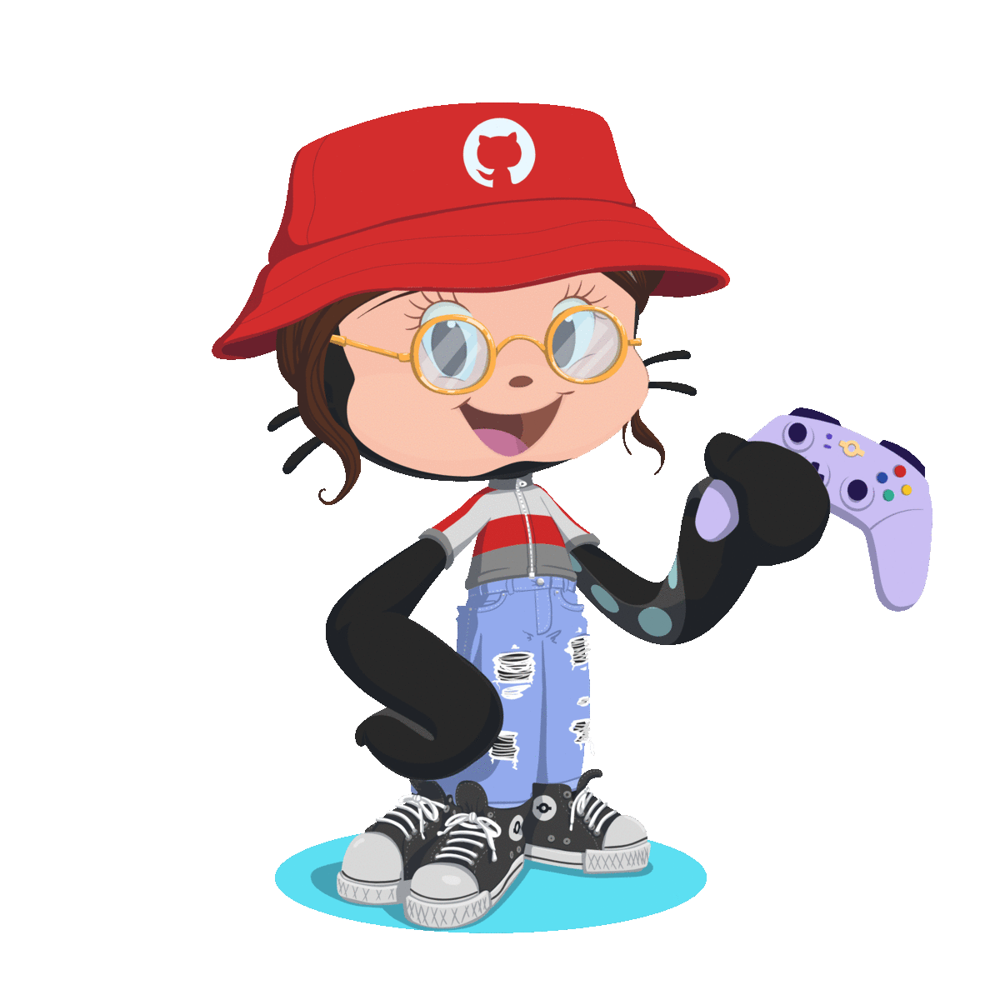

<h1 align="center"> Hi, oi, hola, 안녕하세요 👋 I'm Monique </h1> 

<h2 align="center"> 💚 Android developer 💚 </h3>

### 👩‍💻 My favorite stacks

### 👧 A bit about myself:
- I'm 19 years old and I live in Pernambuco, Brazil.
- I'm an Information Systems undergraduate student at Universidade de Pernambuco
- Dancing is one of my biggest hobbies (specially to k-pop music 😆)

### 

<h1 align="center">
✨ Where you can find me ✨
  
  
 
   
  
  

</h1>
