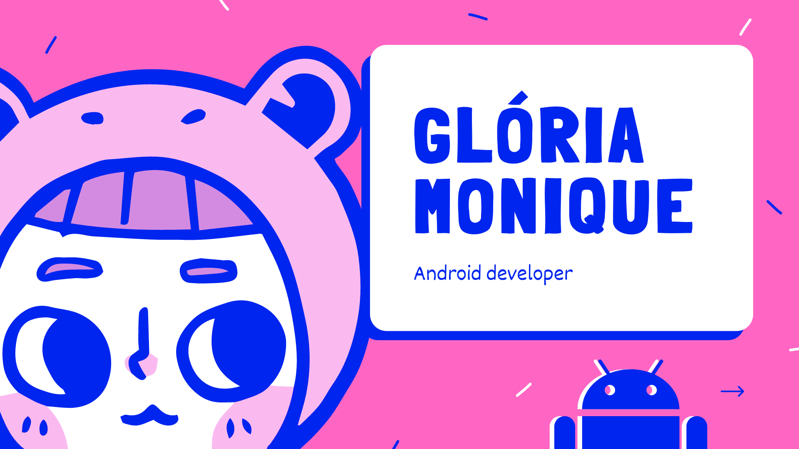

<h1 align="center"> Hey there 👋 I'm Monique </h1> 

### 👩‍💻 My favorite stacks

### 👧 A bit about myself
- I'm a 22-year-old Android developer from Brazil.
- Currently majoring in Information Systems at Universidade de Pernambuco
- Kpop fan (hehe)

<h1 align="center">
✨ Where you can find me ✨
  
  
 
   
  
  
    

</h1>
